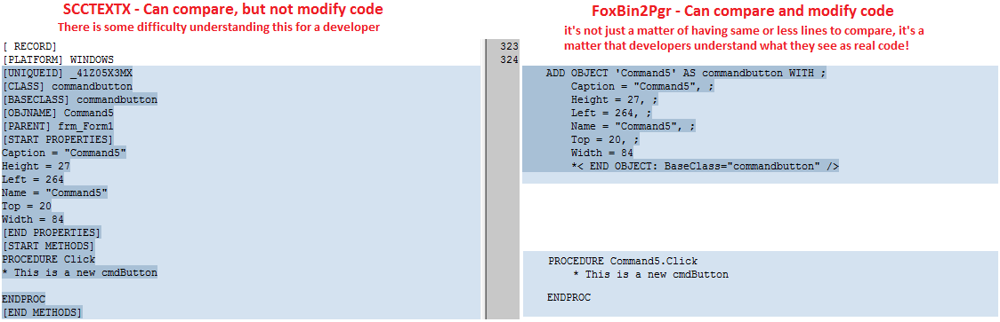

# Purpose of this document
This document is an attempt to recreate the original documentation of FoxBin2Prg out of CodePlex.  
I found the documentation on [foxbin2prg](https://github.com/fdbozzo/foxbin2prg/blob/master/README.md) a bit brief. For a short what and why, see there.

The original document was created by [Fernando D. Bozzo](https://github.com/fdbozzo) whom I like to thank for the great project. Pictures are taken from the original project.  
As far as possible these are the original documents. Changes are added where functionality is changed.

----
   
This project is part of VFPX. 

----
# FoxBin2Prg - a Binary to Text converter for MS Visual Foxpro 9, SP1
## Source
Original repository at https://github.com/fdbozzo/foxbin2prg,
this is a fork available on https://github.com/lscheffler/foxbin2prg/tree/fork
## Requirements
- A copy of MS VFP9 SP1, at least _3504_
- Runs with VFPA
## Demo video
[See YouTube demo video of FoxBin2Prg used with PlasticSCM](http://youtu.be/sE4wQ50Itqg)
## What is FoxBin2Prg
It is a program intended to be used with **SCM** tools (Source Code Managers, like VSS, CVS, SVN)
and **DVCS** tools (like git, Mercurial, Plastic, and others),
or as **standalone** program for _Diff_ (viewing differences) and _Merge_ operations,
that pretends to substitute _SccText/X_ and _TwoFox_ and enhance their functionality,
generating bidirectional PRG-Style versions that allow recreating the original binary file.  
### Advantages:

- It generates _Text_ style programs (not compilable), for visual comparison out of FoxPros table based code.
- It enables the change of the _Text_ version as easy as modifying a PRG
- All the program code is in just one PRG, to simplify its maintainability
- Out of the _Text_ versions you can **regenerate the original binaries**, so it is useful as backup
- The extensions are configurable if you create a FOXBIN2PRG.CFG file
  - Inheritance of CFG configuration files between directories
- Methods and properties of _Text_ version are alphabetically sorted for easy comparison
- Can set _UseClassPerFile_ setting to create individual files by class
- Can set _UseFilesPerDBC_ setting to create individual files by DBC member
- Takes advantage of the API using foxbin2prg as an object
- It has compatibility with SccText/X at parameter level so can be used as substitute with SourceSafe
- Productivity: You can create a shortcut in the "SendTo" folder on your user Windows Profile, so you can "send" the selected file (pjx, pj2, etc) to Foxbin2prg.exe and make on-the-fly conversions
- Modify the _Text_ Prg-Style versions with MODIFY COMMAND (without compile) to see colored syntax, or even use the Document View to navigate the procedures
- Get back your SourceSafe projects (.pjx) from their .pjm files 
- Don't infest a text based system like git with binaries

Currently supports the conversion between PJX, SCX, VCX, FRX, LBX, DBC, DBF and MNX files,
for which a _Text_ version is generated with pj2, sc2, vc2, fr2, lb2, dc2, db2 and mn2 extensions.
The extensions may be reconfigured to be compatible with SCCAPI (just tested with SourceSafe).

### Example
   
   

## Usage
FoxBin2Prg can be used in tree ways:
1. [EXE version](./FoxBin2Prg_Run.md): (Recommended and fastest)   
   - All-inclusive, you just need foxbin2prg.exe and filename_caps.exe/cfg.   
   - Runs from windows
1. [PRG version](./FoxBin2Prg_Run.md):   
   - You need various files: foxbin2prg.prg, all the props*.txt files and filename_caps.exe/cfg.
   - Runs out of VFP IDE, no problems mixing VFP 9 and VFPA
1. [Object version](./FoxBin2Prg_Object.md):
   - Usable out of own code
   - expandable

## Keep reading:
- [FoxBin2Prg Internals and Configuration](./FoxBin2Prg_Internals.md)
- [FoxBin2Prg and use with SCM tools](./FoxBin2Prg_SCM.md)
- [FoxBin2Prg Full Change History](./FoxBin2Prg_Changes.md)

----
Last changed: _Pungenday, 53 Chaos 3187_ 